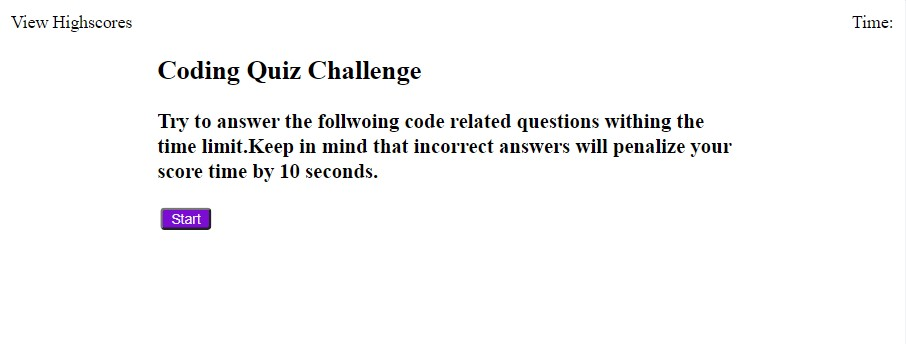
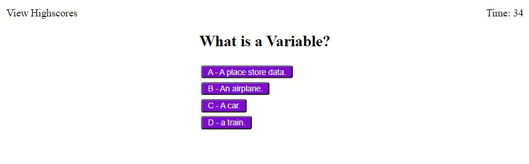
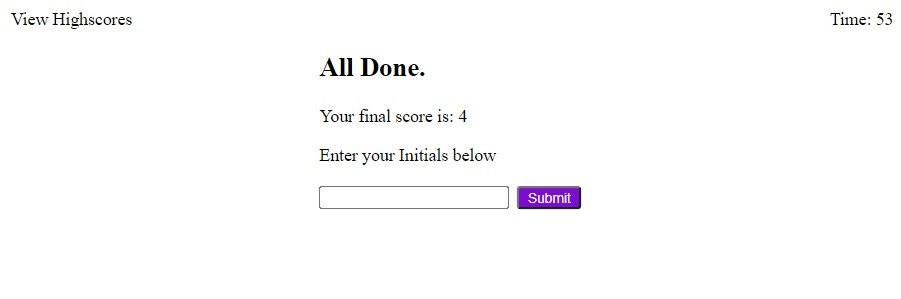
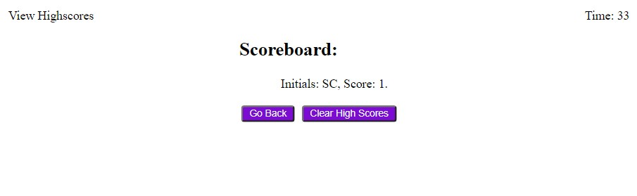

# javasScript-quiz-x

## Description

- This project was developed as a way to test and implement the javascript skills gain from the last module. Some of the main topic we used are event handler and local storage. With the practical experince gained from the activities, my new skills were applied to this quiz game.

## Usage

- This game is relatively simple. You are playing a game to answer as many questions you can withing the given time limit.
- To start the game, press the "start game" button. It will one questions one at a time with multiple choices to chose from.
- If you select the correct choice, then a "correct choice" text appears under the buttons. Otherwise, if your choice is wrong, you get a "wrong choice" text under the buttons.
- Once all the questions have been answered, you will be prompted with a high score and a box to enter your initials.
- Lastly, you can either play again by pressing the "back" button or clear the high scores by pressing the "clear scores" button.

## Game images.

## Review

- The URL of the deployed application. https://sal1316.github.io/javascript-quiz-x/

- The URL of the GitHub repository, https://github.com/Sal1316/javascript-quiz-x
